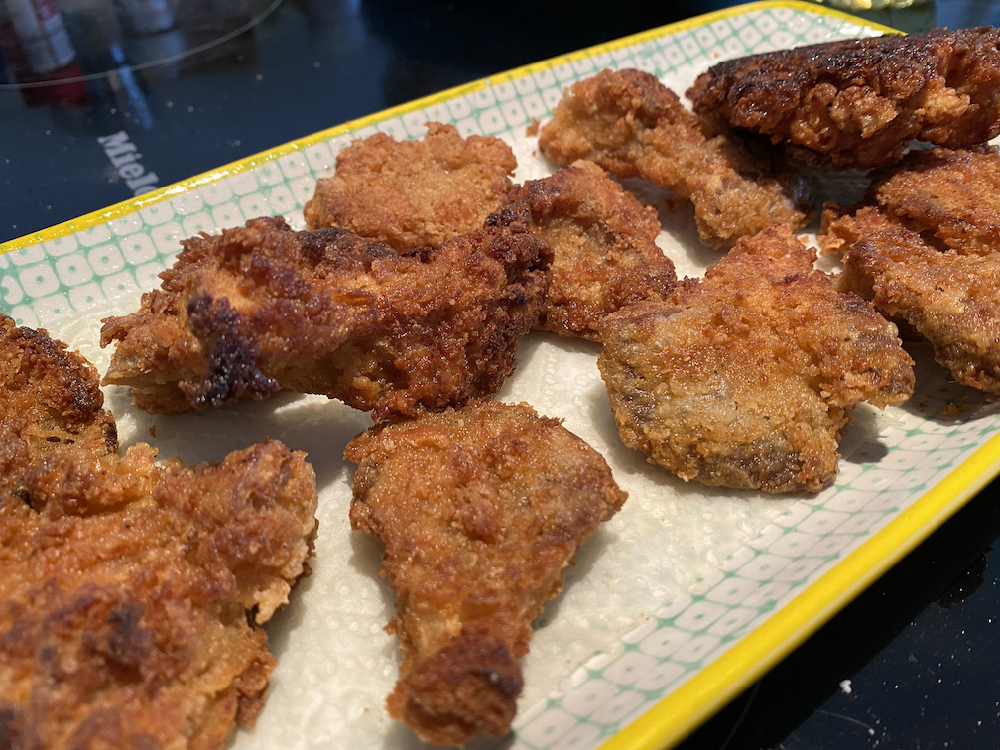

# Austern "Wings"

Diese im Original genannten "Vegan Wings" (ich hab die mal irgendwo auf Instagram entdeckt), sind wirklich eine kleine Koestlichkeit. Benutzt werden hierfuer Austern-Pilze (die es ja in vielen Variationen gibt). Der Austern-Pilz (aehnlich wie der Kraeuterseitling auch) enthaelt selbst sehr wenig Wasser, wodurch er sich hervorragend zum pannieren und brutzeln eignet.

Doch, probiert es selbst. Es gibt nur drei *"P"s* als Zutaten:
1. Pilze
2. Ploerre
3. Panade

### Zutaten fuer die Ploerre
* 150g Mehl
* 1/2 TL Knoblauchpulver
* 1/2 - 1 TL Cayennepfeffer (oder auch frisch gemahlener schwarzer Pfeffer, aber davon dann etwas weniger)
* 1 TL Paprikapulver
* 1 TL Salz
* 1 TL Oregano (oder ein anderes Gewuerz(gemisch) nach Belieben)
* 300ml pflanzliche Milch

### Zutaten fuer die Panade
* 130g Mehl
* 40g Pankomehl
* 1 TL Paprikapulver
* 1/2 TL Cayennepfeffer
* 1 TL Salz

### Zubereitung

Grund und Basis von all dem sind natuerlich die Austern-Pilze.

* Pilze, wenn noetig, ein bisschen uniformieren, aka auf gleiche, Mund- oder Fingerfood gerechte Groesse bringen
* die Zutaten sowohl fuer die Ploerre als auch die Panade in jeweils einer Schuessel gut vermischen
* Die Pilze in die Ploerre tunken und schauen, dass die Lamellen auf der Kappenunterseite auch schoen von der Ploerre durchdrungen werden
* Pilze einzeln aus der Ploerre herausnehmen, in die Panade geben und gut darin herumwaelzen. Die Panade muss wirklich dafuer sorgen, dass keine Ploerre mehr durchblitzt
* Pilz aus der Panade raus und auf einem Brett ruhen lassen
* Wenn alle Pilze paniert sind, dann in einer grossen Pfanne reichlich Oel richtig heiss werden lassen
* Naja, und dann die Pilze darin von allen Seiten goldgelb und wunderknusprig brutzeln. Eh klar.

Fertig. Guten Appetit! 😃