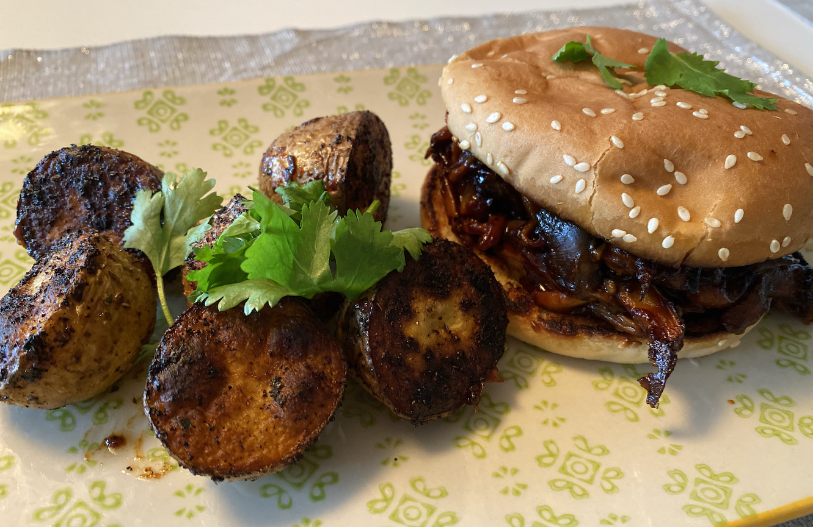
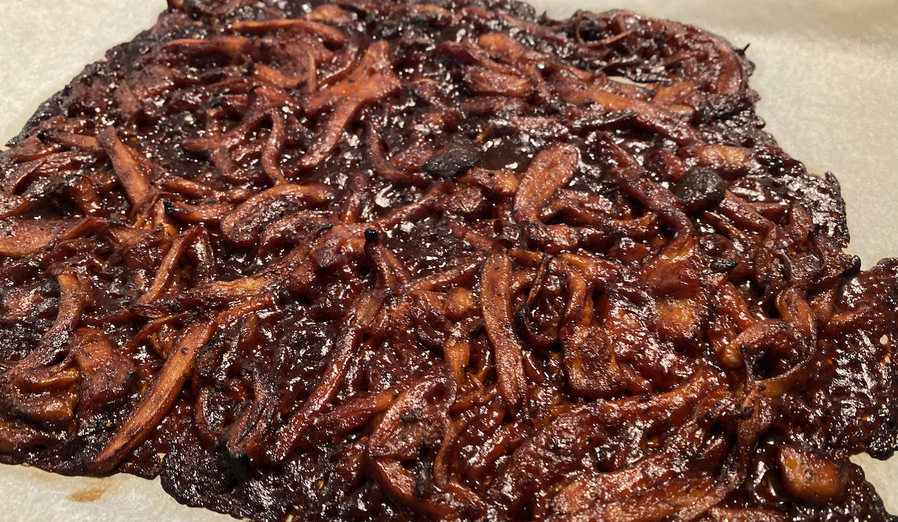

# Pulled "Pork" Burger/Sandwich

Okay, gleich als Klarstellung: Das hier ist ***natuerlich KEIN Pork***! Die optik und Textur erinnert eher an Haehnchenbrustfleisch (Ja, ich war auch mal Fleischfresser). Was hier zum Einsatz kommt sind Pilze: Leckere, frische [Kraeuter-Seitlinge](https://de.wikipedia.org/wiki/Brauner_Kräuter-Seitling). Dieser Pilz eignet sich aufgrund seiner festen Struktur hervorragend zum Zubereiten solcher Gerichte, und er schmeckt mir wirklich ausgezeichnet. Moegliche Alternativen sind aber auch Austernpilze (oder auch [Austern-Seitling](https://de.wikipedia.org/wiki/Austern-Seitling)) ebenso wie die [Jackfrucht](https://eatsmarter.de/lexikon/warenkunde/obst/jackfrucht).

Ich bleib aber erstmal beim Kraeuter-Seitling. Achja, wo hab ich das Rezept her? Nun, da moechte ich mich nicht mit fremden Federn schmuecken. Gefunden habe ich es bei [Derek & Chad Samo](https://wickedhealthyfood.com/about/). Zwei Brueder, die wirklich unglaublich leckere Sachen zaubern. Du kannst dir das [Video zum englischen Original](https://www.youtube.com/watch?v=Hxg38ng2B1I&t=20s) anschauen, oder aber hier die deutsche Schnellversion verwenden.

### Werkzeug
* 1 Gabel
* 1 gute, [schwere Pfanne](https://amzn.to/37tCQLi)
* 2 Schuesseln
* Backofen
* Backpapier, Backblech

### Zutaten (1 Burger/1 Portion)
* 4-5 eher kleinere Kartoffeln (vorwiegend fest kochend/speckig). Und sorry... ich muss schon wieder die "aufgblasenen Golfbaelle" als Groessenvergleich ins Spiel bringen. 🙈
* 3-4 Kraeuter-Seitlinge
* (1 Burger Bun nach Wahl (gekauft oder selbstgemacht)) || (Sandwich-Scheiben nach Wahl)
* Salz, schwarzer Pfeffer, Knoblauchpulver, Gewuerzmischung nach Wahl und Geschmacksvorlieben
* pflanz. Oel oder Vegan Butter
* 1 Flasche BBQ Sosse nach Geschmack (ca. 200ml), evtl. noch'n Schuss Bier

### Zubereitung
* Die Kraeuter-Seitlinge werden zuerst... "gepulled". Wie sagt man das in Deutsch? Hm... keine Ahnung. Also, du nimmst einen Pilz an dessen Kopf in eine Hand, und mit der anderen Hand und der Gabel ziehst du mit der Gabel in den Strunk des Pilzes hinein kleine Streifen raus.  \
Logisch, oder...?  \
Wenn nicht, dann doch besser [beim Original nachschauen](https://youtu.be/Hxg38ng2B1I?t=76).
* Die ganzen Streifen in einer Schuessel deponieren, mit all dem Zeugs von oben wuerzen und das Ganze mit den Haenden vermengen.
* Die Pfanne auf dem Herd/Feuer, ordentlich heiss werden lassen und dann einen Schwung Oel/Butter dazu geben.
* Pilze rein und etwas cross anbruzzeln (nicht zu viel wenden). Kraeuter-Seitlinge haben recht wenig Fluessigkeit. In der Pfanne wird es dann als eher trocken ausschauen. In dem Fall einfach noch ein **bisschen** vom Fett dazu.
* Nebenher die Kartoffeln halbieren, in die gleiche Schuessel geben, in der zuvor die Pilze wahren (da sind ja noch etwas Gewuerze drin!), etwas Oel druebber und ordentlich mit Salz und schwarzem Pfeffer wuerzen.
* Wenn die Pilze ein bisschen Farbe bekommen haben, dann kommen sie aus der Pfanne in die zweite Schuessel. Dazu kommt jetzt die BBQ Sosse und der Schuss Bier. Alles gut vermengen. Das Ganze ergibt dann eine schoen saemige Pampe.
* Zweite Pfanne aufs Feuer, heiss werden lassen, Oel/Butter rein und die halbierten Kartoffeln zuerst mit der Schnittflaeche darin verteilen. Schoen cross anbruzzeln!
* Backpapier aufs Blech, Pilzpampe druff und ab in den vorgeheizten Backofen (200 Grad Celsius Umluft)

* Kartoffeln einmal durchschuetteln, und noch ca. 2 Minuten bruzzeln lassen
* Dann die ganze Pfanne zu den Pilzen in den Backofen
* Waehrend das Zeugs nun im Ofen vor sich hinschmort, in der Pfanne, in der die Kartoffeln waren, etwas Butter rein, und die Buns/Sandwich Scheiben ein bissi knusprig toasten
* So, nach ca. 10-15 Minuten alles wieder aus dem Ofen raus (oder auch schon vorher, wenn's anfaengt zu qualmen).
* Pilzpampe ins Bun/zwischen die Toastscheiben und zusammen mit den Kartoffeln auf einem echt nicen Teller servieren und geniessen.

Bon appétit! 🍔