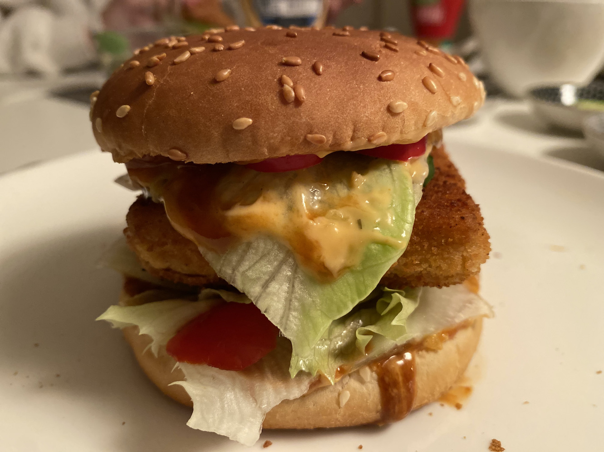

# Vegan Burger

Die Inspiration zu diesem wirklich einfachen, schnell zubereitetem und echt leckerem Burger kam mir beim Stoebern im Buch von [Gaz Oakley](https://www.avantgardevegan.com), dessen Rezepte ich wirklich liebe! Nach der ersten Zubereitung saßen meine beiden Maedels und ich am Tisch, betrachteten dieses optisch gar nicht so uebel gelungene Stueck Futter und dachten: *"Okaay... mal schauen, was uns da erwartet."*

Die Reaktion folgte auf den Schlag von uns Dreien gleichzeitig: *"Boah, ist das lecker!"*. Sowohl meine Frau als auch Toechterchen wollten ab diesem Moment gar keine anderen Burger mehr essen. Mission accomplished! 😎

### Zutaten (4 Burger)
* Burger-Buns nach Wahl (gekauft oder selbstgemacht)
* 1 Stueck Tofu (fest, nicht zu waessrig)
* Gurken, Paprika, Tomaten, Salat in gewuenschter Menge zum Belegen
* diverse Burger-Sossen nach Wahl
* Mais-Staerke, ca. 3 gehaeufte Essloeffel
* Salz, Pfeffer, suesses Paprika-Pulver, Knoblauch-Pulver
* Semmelbroesel
* Wasser
* Pflanzenoel oder vegan Butter

### Zubereitung
* Zuerst die Panierploerre anruehren. Dazu die Maisstaerke mit den Gewuerzen vermischen und Wasser hinzugeben. Nicht zu viel und nicht zu wenig. Aber bitte bei den Gewuerzen ruhig ordentlich zulangen! Irgendwo muss der Geschmack ja herkommen (vom Tofu ganz sicher nicht). Das Ganze sollte geradeso nicht mehr nichtnewtonisch sein (siehe unten). 🤪\
\
*Spannende Randnotiz*: Dieses Maisstaerke-Wasser Gemisch ergibt eine so genannte *"[nichtnewtonische Flüssigkeit](https://de.wikipedia.org/wiki/Rheologie#Eigenschaften_nichtnewtonscher_Flüssigkeiten)"*. Eine Fluessigkeit also, die sich bei langsamen Bewegungen wie eine normale Fluessigkeit (Wasser) verhaelt, jedoch bei schnellen Bewegungen Eigenschaften eines Festkoerpers zeigt. Da gibt es echt [witzige Experimente](https://www.youtube.com/watch?v=RIUEZ3AhrVE) dazu.

Okay, weiter mit dem Futter...
* Nun als Vorbereitung das ganze Beilagengemuese in handliche Teilchen schnibbeln. Das soll ja dann spaeter alles irgendwie in den Burger rein.
* Den Tofu in ca. 1cm dicke Scheiben schneiden. Laengs oder quer zum Stueck, das ist Wumpe. Es muss hinterher halt aufs Bun passen.
* Die Tofu-Stuecke nun in der Ploerre marinieren. Die saugen sich schon etwas mit dem Zeugs voll. Je laenger sie also drin liegen, um so mehr der Wuerze ziehen sie auch.
* Dann aus der Ploerre direkt ins Semmelbroeselbad beamen, und von allen Seiten panieren. Scheibe beiseite legen, und das Gleiche mit dem naechsten Stueck Tofu nochmal. Ich exerziere dieses Prozedere fuer jede Scheibe auch gern zweimal, so wird das Ganze knuspriger und wuerziger.
* Nun eine ausreichend grosse Pfanne mit dem Oel/Fett auf Touren bringen. Zunaechst mal volle Pulle, und dann zurueck auf zwei Drittel von volle Pulle. Mit dieser Temperatur bruzeln wir dann auch die Scheiben.
* Nebenher ruhig schonmal die aufgeschnittenen Buns entweder im Toaster oder mit etwas Butter bestrichen in einer weiteren Pfanne knusprig toasten.
* Wenn das Oel/Fett heiss genug ist, wandern die Tofu-Teilchen genau da rein. Wichtig ist, dass das Oel/Fett wirklich nicht zu heiss ist. Sonst sind die Dinger schneller schwarz als einem lieb ist.

So, mal ueberlegen... Buns sind getoastet, Tofu ist frittiert, Gemuese ist gechnibbelt. Joa, sollte soweit alles sein. Das ganze Gedoens optisch ansprechend auf dem Tisch verteilen, Teller und Servietten dazu und nun Frau/Mann sowie evtl. vorhandene/s Kind/er rufen (oder auch nicht).

Bon appétit! 🍔